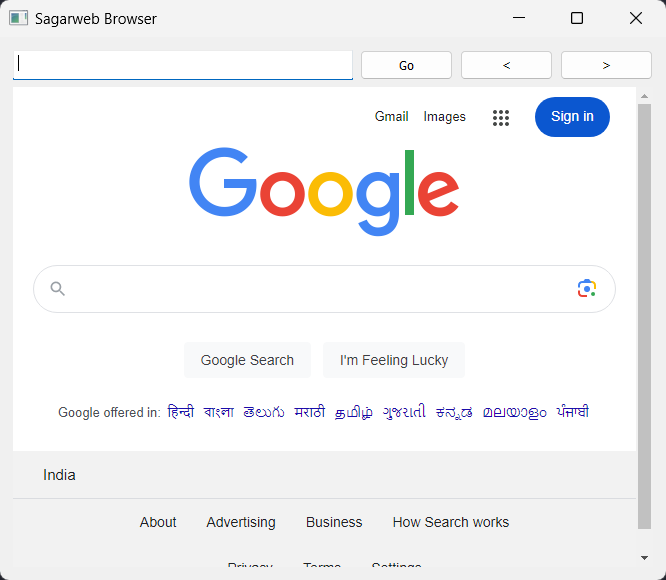
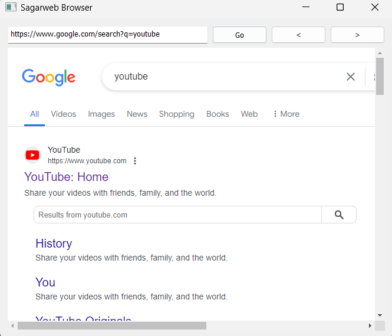
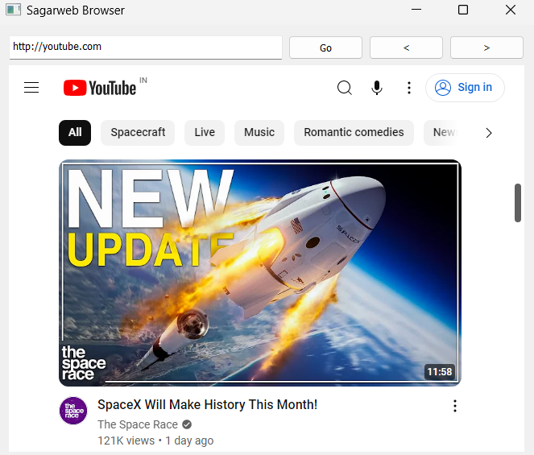

# Simple Web Browser

## Description
This project is a simple web browser developed by Srouser. It offers minimal features with a focus on ease of use.

## Features
- Back and Forward buttons for navigating through the history
- Handles valid URLs and provides fallback to a search query for incomplete entries

    
    
    
